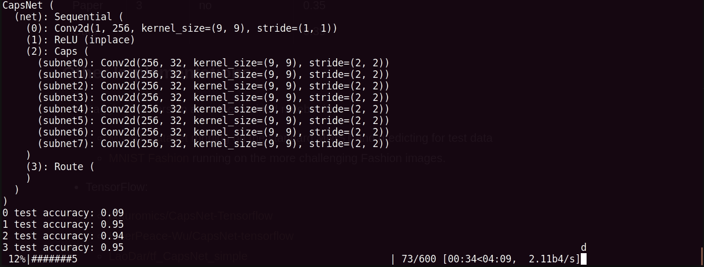
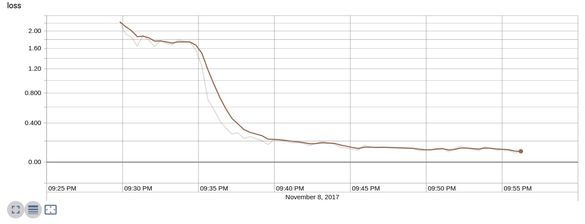

# CapsNet-Pytorch
Pytorch version of Hinton's paper: [Dynamic Routing Between Capsules](https://arxiv.org/abs/1710.09829)
> Some implementations of CapsNet have potential problems and it's uneasy to realize the bugs since MNIST is simple to achieve satisfying accuracy.

# Network

# Screenshots
- running

- training loss

# Highlights
- Highly abstraction of Caps layer, by re-write function `create_cell_fn` you can implement your sub-network inside a capsule
>    def create_cell_fn(self):  
        """  
        create sub-network inside a capsule.  
        :return:  
        """  
        conv1 = nn.Conv2d(self.conv1_kernel_num, self.caps1_conv_kernel_num, kernel_size = self.caps1_conv_kernel_size, stride = self.caps1_conv1_stride)  
        #relu = nn.ReLU(inplace = True)  
        #net = nn.Sequential(conv1, relu)  
        return conv1  
- Highly abstraction of routing layer by class `Route`, you can take use of `Caps` Layer and `Route` Layer to construct any type of network

## Status

- Currently we train our model for 30 epochs, which means it is potentially promising if more epochs are used to train
- We don not use reconstruction loss now, and will add it later
- The critical part of code is well commented with each dimension changes, which means you can follow the comments to understand the routing mechnism

## TODO
- add reconstruction loss
- test on more convincing dataset, such as ImagetNet

## About me
> I'm a Research Assistant @ National University of Singapre, before joinging NUS, I was a first-year PhD candidate in Zhejiang University and then quitted.
Contact me with email: dcslong@nus.edu.sg or wechat: dragen1860

# Usage

## Step 1. Install Conda, CUDA, cudnn and Pytorch
>conda install pytorch torchvision cuda80 -c soumith

## Step 2. Clone the repository to local
>git clone https://github.com/dragen1860/CapsNet-Pytorch.git
>cd CapsNet-Pytorch

## Step 3. Train CapsNet on MNIST

1. please modify the variable `glo_batch_size = 125` to appropriate size according to your GPU memory size.
2. run
>$ python main.py
3. turn on tensorboard version of pytorch
>$ tensorboard --logdir runs 

4. OR you can comment the part of train code and test its performance with pretrained model `mdl` file.

# Results

| Model    | Routing | Reconstruction | MNIST |   |
|----------|---------|----------------|-------|---|
| Baseline | -       | -              | 0.39  |   |
| Paper    | 3       | no             | 0.35  |   |
| Ours     |         |                | 0.39  |   |

It takes about 150s per epoch for single GTX 970 4GB Card.

## Other Implementations
- Kaggle (this version as self-contained notebook):
  - [MNIST Dataset](https://www.kaggle.com/kmader/capsulenet-on-mnist) running on the standard MNIST and predicting for test data
  - [MNIST Fashion](https://www.kaggle.com/kmader/capsulenet-on-fashion-mnist) running on the more challenging Fashion images.
- TensorFlow:
  - [naturomics/CapsNet-Tensorflow](https://github.com/naturomics/CapsNet-Tensorflow.git)   
  - [InnerPeace-Wu/CapsNet-tensorflow](https://github.com/InnerPeace-Wu/CapsNet-tensorflow)  
  - [LaoDar/tf_CapsNet_simple](https://github.com/LaoDar/tf_CapsNet_simple)

- PyTorch:  
  - [gram-ai/capsule-networks](https://github.com/gram-ai/capsule-networks) 
  - [leftthomas/CapsNet](https://github.com/leftthomas/CapsNet)
  
- MXNet:
  - [AaronLeong/CapsNet_Mxnet](https://github.com/AaronLeong/CapsNet_Mxnet)
  
- Lasagne (Theano):
  - [DeniskaMazur/CapsNet-Lasagne](https://github.com/DeniskaMazur/CapsNet-Lasagne)

- Chainer:
  - [soskek/dynamic_routing_between_capsules](https://github.com/soskek/dynamic_routing_between_capsules)